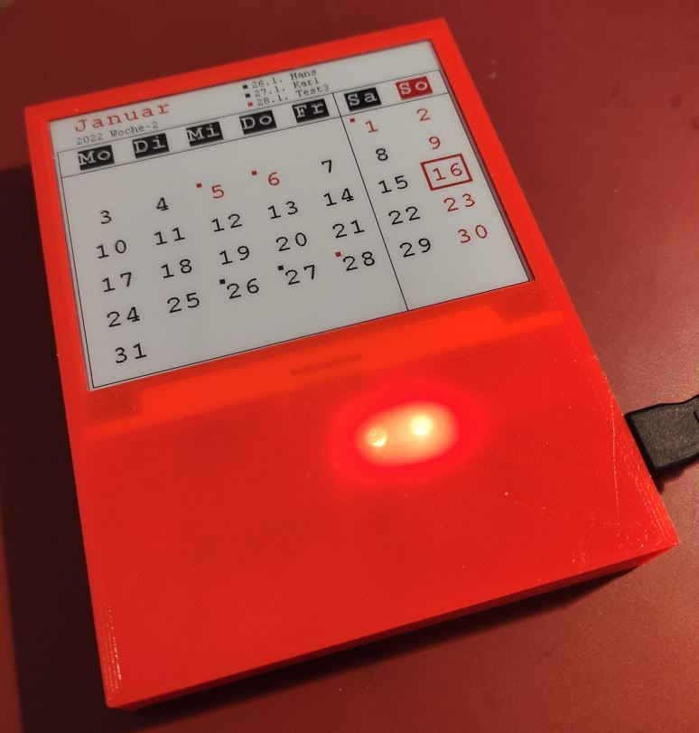
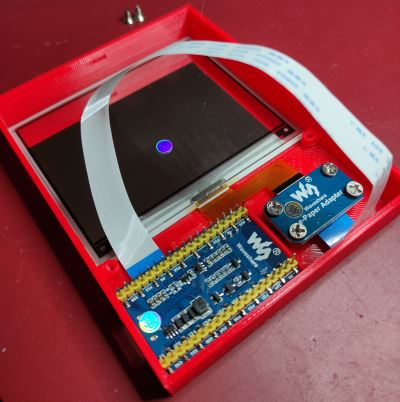
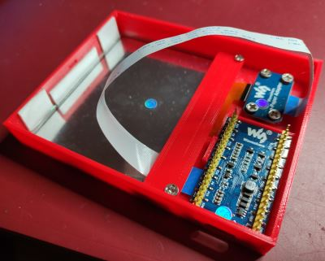
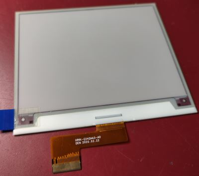
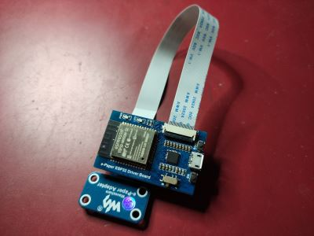

# k42_display (e-paper-Kalender)
## Kalender auf WaveShare e-paper-Display mit ESP32 Driver Board:
Dieses Projekt basiert auf Arduino und läuft auf einem ESP32 Mikrocontroller.  
Es ist sehr einfach aufzubauen, da das Projekt fertige Komponenten verwendet,  
die nur mit Hilfe eines Flachbandkabels verbunden werden müssen.

## Funktionen:
 - Anzeige der Feiertage
 - Anzeige von Geburtstagen oder anderen Jahrestagen
 - Konfiguration über WEB-Interface
 - OTA Update

  
  

## Hardware:
- Waveshare Universal e-Paper Raw Panel Driver Board, ESP32
- Waveshare 4,2 inch 400x300 E-Ink E-Paper Raw Display Three-color (red) Arduino

   
 

## Arduino Library:
- EPD.h  
das ist die original WaveShare Library um das Display anzusteuern.  
esp32-waveshare-epd siehe: https://www.waveshare.com/wiki/E-Paper_ESP32_Driver_Board

## 3D-STL Files:
Die 3D-STL Druckdateien liegen auf: https://www.thingiverse.com/thing:5204499