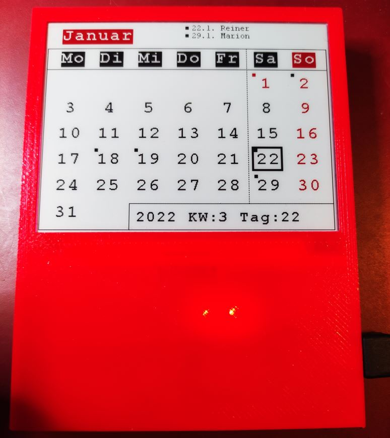

# k42_display (e-paper-Kalender)
## Kalender auf WaveShare e-paper-Display:
 - Anzeige der Feiertage
 - Anzeige von Geburtstagen oder anderen Jahrestagen
 - Konfiguration über WEB-Interface
 - OTA Update

 

## Hardware:
- Waveshare Universal e-Paper Raw Panel Driver Board, ESP32
- Waveshare 4,2 inch 400x300 E-Ink E-Paper Raw Display Three-color (red) Arduino

   
 

## Arduino Library:
- EPD.h  
das ist die original WaveShare Library um das Display anzusteuern.  
esp32-waveshare-epd siehe: https://www.waveshare.com/wiki/E-Paper_ESP32_Driver_Board